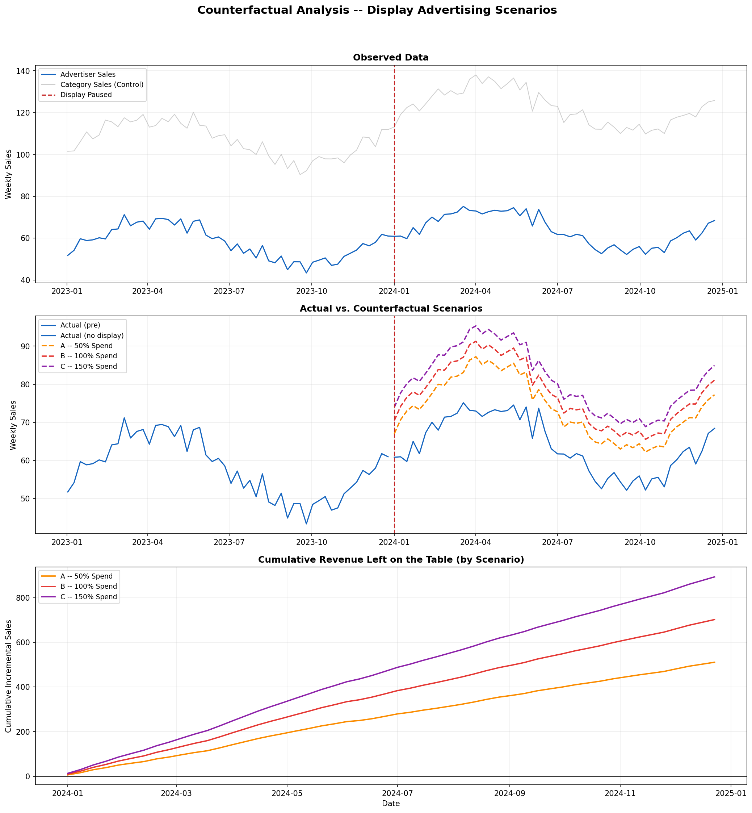
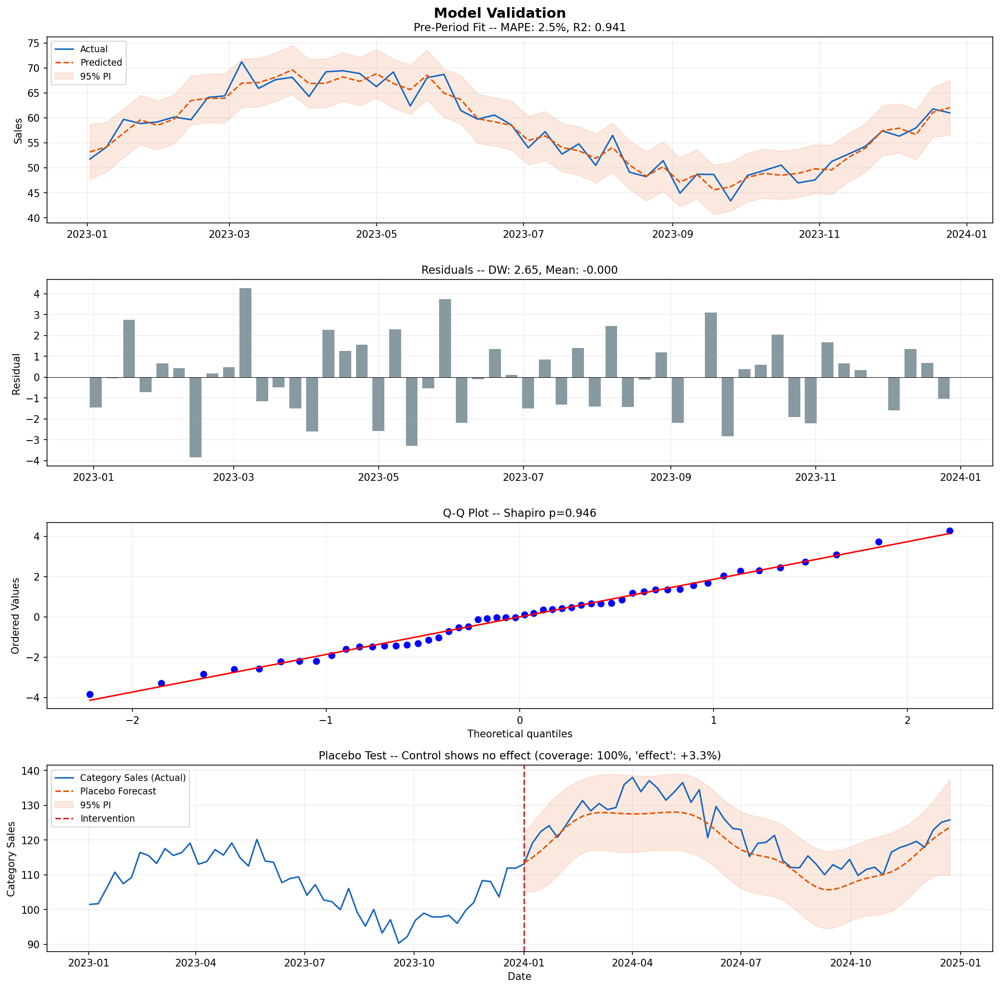

# Counterfactual Analysis with Structural Time Series

**What would have happened if nothing changed?**

An advertiser suddenly stops investing in display ads. Revenue dips, but how much of that dip is actually caused by pulling the ads versus normal market fluctuations? And more importantly, how much revenue are they *leaving on the table* by not spending?

This project demonstrates how to answer that question using a structural time series approach, the same core methodology behind [Google's CausalImpact](https://google.github.io/CausalImpact/CausalImpact.html). Rather than relying on a black-box library call, the model is built transparently from components so every assumption is visible and every output is explainable to non-technical stakeholders.

---

## The Approach

The model decomposes an advertiser's weekly sales into three components, fit only on the **pre-intervention period**:

| Component | What it captures |
|---|---|
| **Linear trend** | Underlying growth trajectory |
| **Fourier seasonality** | 52-week cyclical patterns via sin/cos harmonics |
| **Control series regression** | Category-level sales that share the same market dynamics but are unaffected by the advertiser's individual display decision |

Once the model learns these relationships from the pre-period, it projects a **counterfactual** into the post-period: what sales *would have been* if the advertiser had continued spending. The gap between actual and counterfactual is the estimated causal impact.

### Why not Difference-in-Differences?

DiD assumes parallel trends and works best with multiple treated and control units. This scenario has **one treated unit** (one advertiser) with **strong seasonality** and no clean control group of comparable advertisers. BSTS handles all of this natively and produces prediction intervals rather than just point estimates.

---

## Three Scenarios, Not Just On/Off

Rather than a single "what if they kept spending" counterfactual, the analysis models **three investment levels** to give decision-makers a menu of options:

| Scenario | Description | Result |
|---|---|---|
| **A: 50% Spend** | Conservative re-entry | +15% weekly sales uplift |
| **B: 100% Spend** | Full restoration | +21% weekly sales uplift |
| **C: 150% Spend** | Growth investment | +27% weekly sales uplift |

This reframes the conversation from "should we spend?" to "how much should we spend?", which is a much easier conversation.



---

## Validation

The analysis includes four validation checks to ensure the counterfactual is trustworthy, not just plausible-looking:

**1. Pre-period fit (MAPE)**
If the model can't accurately predict what already happened before the intervention, it can't be trusted to project what would have happened after. Pre-period MAPE of ~2.5%.

**2. Prediction interval calibration**
Verifies that the 95% prediction intervals actually contain ~95% of observations. Too low means overconfident estimates; too high means the intervals are too wide to be useful.

**3. Residual diagnostics**
Shapiro-Wilk normality test and Durbin-Watson autocorrelation check confirm no systematic patterns in the prediction errors.

**4. Placebo test on the control series**
Fits the same model on category-level sales (which are *known* to be unaffected by the intervention) and verifies it detects **no spurious effect**. This rules out the possibility that the methodology itself is producing false positives.



---

## Usage

```bash
pip install numpy pandas matplotlib statsmodels scipy
python bsts_counterfactual.py
```

The script generates two plot files (`bsts_main.png`, `bsts_validation.png`) and prints all metrics to stdout.

To adapt for your own data, replace the simulation block (Section 1) with your actual time series and control series, and set `intervention_week` to the index where the intervention occurred.

---

## Project Structure

```
bsts_counterfactual.py    # Full analysis: simulation, model, validation, scenarios, plots
README.md
bsts_main.png             # Counterfactual scenario comparison (generated)
bsts_validation.png       # Four-panel validation suite (generated)
```

---

## Key Concepts

- **Counterfactual estimation**: Modeling what *would have happened* under a scenario that didn't occur
- **Structural time series**: Decomposing a signal into interpretable components (trend, seasonality, regression)
- **Causal inference without randomization**: Using observational data and a control series to estimate causal effects when A/B testing isn't feasible
- **Placebo testing**: Stress-testing whether the methodology itself could be producing false results

---

## References

- Brodersen, K.H., et al. (2015). [Inferring causal impact using Bayesian structural time series models](https://research.google/pubs/pub41854/). *Annals of Applied Statistics*.
- Google CausalImpact [documentation](https://google.github.io/CausalImpact/CausalImpact.html)
