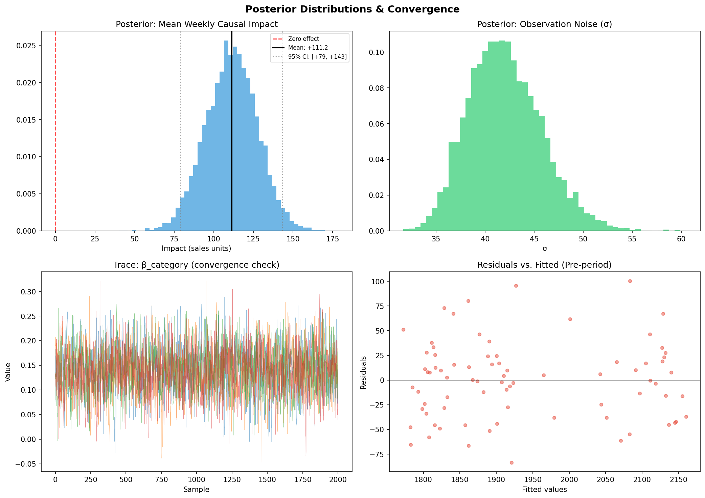

# Counterfactual Analysis with Structural Time Series

**What would have happened if nothing changed?**

An advertiser suddenly stops investing in display ads. Revenue dips, but how much of that dip is actually caused by pulling the ads versus normal market fluctuations? And more importantly, how much revenue are they *leaving on the table* by not spending?

This project demonstrates how to answer that question using a structural time series approach, the same core methodology behind [Google's CausalImpact](https://google.github.io/CausalImpact/CausalImpact.html). Rather than relying on a black-box library call, the model is built transparently from components so every assumption is visible and every output is explainable to non-technical stakeholders.

---

## Two Versions

This repo contains two implementations of the same structural decomposition, differing in estimation approach:

| | `bsts_counterfactual.py` | `bsts_counterfactual_bayesian.py` |
|---|---|---|
| **Estimation** | OLS (frequentist) | PyMC + MCMC / NUTS (Bayesian) |
| **Uncertainty** | Prediction intervals from residual variance | Credible intervals from the posterior predictive |
| **Interpretation** | "95% of intervals constructed this way would contain the true value" | "There is a 95% probability the true value lies in this range" |
| **Outputs** | Point estimates + prediction intervals | Full posterior distributions over all parameters |
| **Dependencies** | numpy, pandas, matplotlib, statsmodels, scipy | numpy, pandas, matplotlib, pymc, arviz, scipy |
| **Runtime** | Seconds | ~2 minutes (MCMC sampling) |
| **Use case** | Transparent, portable, minimal dependencies | Production-grade inference with proper uncertainty quantification |

Both versions use the same structural decomposition, the same three spend scenarios, and the same four-check validation suite. The difference is *how* uncertainty is quantified — frequentist prediction intervals vs. Bayesian credible intervals.

The Bayesian version additionally produces:
- Full posterior distributions over all model coefficients
- A posterior distribution of the causal impact (not just a point estimate)
- Direct probability statements: "There is a P% probability that stopping spend reduced sales"
- Convergence diagnostics (R-hat, effective sample size, trace plots)

**When to use which:** The OLS version is better for quick iteration, portability, and environments where PyMC isn't available. The Bayesian version is better for production measurement where credible intervals and direct probability statements matter — e.g., telling a client "there is a 95% probability that your campaign lifted sales by between X and Y."

---

## The Approach

The model decomposes an advertiser's weekly sales into three components, fit only on the **pre-intervention period**:

| Component | What it captures |
|-----------|-----------------|
| **Linear trend** | Underlying growth trajectory |
| **Fourier seasonality** | 52-week cyclical patterns via sin/cos harmonics |
| **Control series regression** | Category-level sales that share the same market dynamics but are unaffected by the advertiser's individual display decision |

Once the model learns these relationships from the pre-period, it projects a **counterfactual** into the post-period: what sales *would have been* if the advertiser had continued spending. The gap between actual and counterfactual is the estimated causal impact.

### Why not Difference-in-Differences?

DiD is a natural candidate here. You have a pre/post intervention and a potential control series in category-level sales. But in practice — at least in the retail media context where this analysis originated — DiD runs into constraints that make it unworkable as a reusable solution:

**Data governance blocks competitor-level controls.** The most natural DiD control would be a comparable advertiser in the same category. But data governance prohibits sharing one advertiser's performance with another — you'd be revealing a competitor's sales data. That eliminates single-advertiser controls entirely.

**Category-level controls require enough competition.** Data governance does allow reporting category-level aggregates, but only when there are roughly 5-6+ large competitors in the category to ensure no single advertiser's performance is identifiable. Many categories don't clear that bar — a category with two dominant players and a few small ones can't produce an aggregate that doesn't implicitly reveal the competitors.

**Even when category data is available, parallel trends aren't guaranteed.** DiD assumes treatment and control would have followed parallel trajectories absent the intervention. With one advertiser and a category aggregate, that's hard to defend — the advertiser's trajectory can diverge for reasons unrelated to the intervention (product launches, pricing shifts, distribution changes). This alone would block DiD from becoming a reusable, repeatable solution across clients and categories.

**BSTS sidesteps these constraints.** The structural time series approach doesn't require a "control group" in the DiD sense. The category series is one input among several — the model learns the relationship between the advertiser's sales and its covariates (trend, seasonality, category) in the pre-period, then projects the counterfactual. If category data isn't available due to governance constraints, the model can still run on trend and seasonality alone (weaker, but functional). And the core assumption — that the covariate relationship is stable across pre- and post-periods — is directly testable from the pre-period fit metrics (see Validation 1), unlike parallel trends which you're largely taking on faith.

---

## Three Scenarios, Not Just On/Off

Rather than a single "what if they kept spending" counterfactual, the analysis models **three investment levels** to give decision-makers a menu of options:

| Scenario | Description | Result |
|----------|-------------|--------|
| **A: 50% Spend** | Conservative re-entry | +15% weekly sales uplift |
| **B: 100% Spend** | Full restoration | +21% weekly sales uplift |
| **C: 150% Spend** | Growth investment | +27% weekly sales uplift |

This reframes the conversation from "should we spend?" to "how much should we spend?", which is a much easier conversation.


---

## Validation

The analysis includes four validation checks to ensure the counterfactual is trustworthy, not just plausible-looking:

**1. Pre-period fit (MAPE)** If the model can't accurately predict what already happened before the intervention, it can't be trusted to project what would have happened after. Pre-period MAPE of ~2.5%.

**2. Prediction interval calibration** Verifies that the 95% prediction/credible intervals actually contain ~95% of observations. Too low means overconfident estimates; too high means the intervals are too wide to be useful.

**3. Residual diagnostics** Shapiro-Wilk normality test and Durbin-Watson autocorrelation check confirm no systematic patterns in the prediction errors.

**4. Placebo test on the control series** Fits the same model on category-level sales (which are *known* to be unaffected by the intervention) and verifies it detects **no spurious effect**. This rules out the possibility that the methodology itself is producing false positives.


### Bayesian-specific diagnostics

The Bayesian version adds convergence diagnostics:

- **R-hat** (< 1.05 indicates convergence across chains)
- **Effective sample size** (ESS > 400 per chain is adequate)
- **Trace plots** for visual convergence inspection
- **Posterior distribution of causal impact** with direct probability statements



---

## Usage

### OLS version (minimal dependencies)
```
pip install numpy pandas matplotlib statsmodels scipy
python bsts_counterfactual.py
```

### Bayesian version (PyMC)
```
pip install numpy pandas matplotlib pymc arviz scipy
python bsts_counterfactual_bayesian.py
```

Both scripts generate plot files and print all metrics to stdout.

To adapt for your own data, replace the simulation block (Section 1) with your actual time series and control series, and set `intervention_week` to the index where the intervention occurred.

---

## Project Structure

```
bsts_counterfactual.py            # OLS version: simulation, model, validation, scenarios
bsts_counterfactual_bayesian.py   # Bayesian version: PyMC + MCMC, posterior inference
README.md
bsts_main.png                     # OLS counterfactual scenario comparison (generated)
bsts_validation.png               # OLS four-panel validation suite (generated)
bsts_bayesian_main.png            # Bayesian counterfactual + scenarios (generated)
bsts_bayesian_diagnostics.png     # Bayesian posterior distributions + convergence (generated)
```

---

## Key Concepts

- **Counterfactual estimation**: Modeling what *would have happened* under a scenario that didn't occur
- **Structural time series**: Decomposing a signal into interpretable components (trend, seasonality, regression)
- **Bayesian inference**: Full posterior distributions over model parameters, enabling direct probability statements about causal effects
- **Causal inference without randomization**: Using observational data and a control series to estimate causal effects when A/B testing isn't feasible
- **Placebo testing**: Stress-testing whether the methodology itself could be producing false results

---

## References

- Brodersen, K.H., et al. (2015). [Inferring causal impact using Bayesian structural time series models](https://research.google/pubs/pub41854/). *Annals of Applied Statistics*.
- Google CausalImpact [documentation](https://google.github.io/CausalImpact/CausalImpact.html)
- Salvatier J., Wiecki T.V., Fonnesbeck C. (2016). [Probabilistic programming in Python using PyMC3](https://doi.org/10.7717/peerj-cs.55). *PeerJ Computer Science*.
